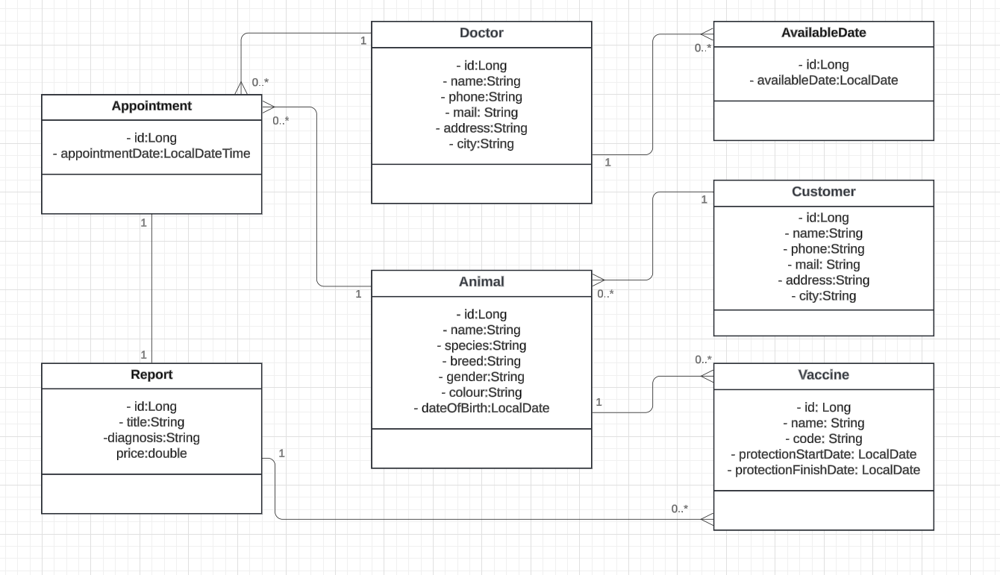

# Vet-Application

# Veteriner Yönetim Sistemi
Veteriner Yönetim Sistemi, bir veteriner kliniğinin işlerini yönetebilmesi amacıyla geliştirilen bir API'yi içerir. Aşağıda projenin temel özellikleri ve kullanılan teknolojiler özetlenmiştir:

## API Temel Özellikleri:

### Hayvanların ve sahiplerinin yönetimi:

Hayvanları kaydetme, güncelleme, görüntüleme ve silme; sahipleri kaydetme, güncelleme, görüntüleme ve silme; filtreleme end point'leri oluşturma.

### Uygulanan aşıların yönetimi:

Aşıları kaydetme, güncelleme, görüntüleme ve silme; aşı koruyuculuk tarihlerine göre filtreleme end point'leri oluşturma.

### Randevu yönetimi:

Randevu oluşturma, güncelleme, görüntüleme ve silme; doktor ve tarih aralığına göre filtreleme end point'leri oluşturma.

### Veteriner doktor yönetimi:

Doktorları kaydetme, güncelleme, görüntüleme ve silme.

### Doktorların müsait günlerinin yönetimi:

Müsait günleri ekleme, güncelleme, görüntüleme ve silme.

### Rapor yönetimi:

Raporları kaydetme, güncelleme, görüntüleme ve silme.

### Teknolojik Detaylar:

Spring Boot kullanılarak katmanlı mimari yapısı oluşturulmuştur.
IoC ve DI için constructor injection kullanılmıştır.
PostgreSQL veritabanı kullanılmıştır.
HTTP durum kodları anlamlı ve doğru bir şekilde kullanılmıştır.
Request ve Response DTO'ları kullanılarak veri transferi sağlanmıştır.
API end point'lerini tanımlayan bir dokümantasyon oluşturulmuştur.

### Dikkat Edilen Hususlar:

Veritabanına örnek veriler eklenmiş ve .sql dosyası projeye eklenmiştir.
Hibernate Fetch ve Cascade anotasyonları kullanılmıştır.
Tüm yeni veri kaydetme işlemlerinde var olan bir verinin kaydedilmediği kontrol edilmiştir.
Proje içerisinde entity sınıfları ve ilişkiler belirlenmiş ve gerekli anotasyonlar eklenmiştir.

### Entity Sınıfları:

Animal: Hayvan bilgilerini içerir.  
Customer: Müşteri bilgilerini içerir.  
Vaccine: Aşı bilgilerini içerir.  
Doctor: Veteriner doktor bilgilerini içerir.  
AvailableDate: Veteriner doktorların müsait günlerini içerir.  
Appointment: Randevu bilgilerini içerir.
Report: Rapor bilgilerini içerir.

# EndPoint

## Doctor

| İşlem   | Metod | Endpoint                        | Açıklama                 |
|---------|-------|---------------------------------|--------------------------|
| getAll  | GET   | localhost:8080/v1/doctor        | Tüm doktorları getir     |
| getById | GET   | localhost:8080/v1/doctor/{id}   | ID'ye göre doktor getir  |
| save    | POST  | localhost:8080/v1/doctor/save   | Yeni doktor kaydet       |
| update  | PUT   | localhost:8080/v1/doctor/update/{id} | ID'ye göre doktor güncelle |
| delete  | DELETE| localhost:8080/v1/doctor/{id}       | ID'ye göre doktor sil    |

## Animal

| İşlem              | Metod | Endpoint                                                   | Açıklama                               |
|--------------------|-------|------------------------------------------------------------|----------------------------------------|
| getAll             | GET   | localhost:8080/v1/animal                                   | Tüm hayvanları getir                   |
| getById           | GET   | localhost:8080/v1/animal/{id}                              | ID'ye göre hayvan getir                |
| save               | POST  | localhost:8080/v1/animal/save                              | Yeni hayvan kaydet                     |
| update             | PUT   | localhost:8080/v1/animal/update/{id}                       | ID'ye göre hayvan güncelle             |
| delete             | DELETE| localhost:8080/v1/animal/{id}                              | ID'ye göre hayvan sil                  |
| getByCustomerName  | GET   | localhost:8080/v1/animal/byOwnerName?ownerName={ownerName} | Müşteri adına göre hayvanları getir |
| getByAnimalName    | GET   | localhost:8080/v1/animal/byName?name={animalName}          | Hayvan adına göre hayvanları getir  |
| getCustomerAnimals | GET   | localhost:8080/v1/animal/customer?customerId={id}          | Müşteriye ait hayvanları getir        |

## Vaccine

| İşlem                  | Metod | Endpoint                                              | Açıklama                                  |
|------------------------|-------|-------------------------------------------------------|-------------------------------------------|
| getAll                 | GET   | localhost:8080/v1/vaccine                             | Tüm aşıları getir                         |
| getById               | GET   | localhost:8080/v1/vaccine/{id}                            | ID'ye göre aşı getir                      |
| save                   | POST  | localhost:8080/v1/vaccine/save                        | Yeni aşı kaydet                           |
| update                 | PUT   | localhost:8080/v1/vaccine/update/{id}                     | ID'ye göre aşı güncelle                   |
| delete                 | DELETE| localhost:8080/v1/vaccine/{id}                            | ID'ye göre aşı sil                        |
| ByProtectionDateRange | POST  | localhost:8080/v1/vaccine/vaccinesByProtectionDateRange | Belirli tarih aralığındaki aşıları getir |
| gelAnimalVaccines     | GET   | localhost:8080/v1/vaccine/byAnimal/{id}                   | Hayvana ait aşıları getir                 |

## Customer

| İşlem   | Metod | Endpoint                            | Açıklama               |
|---------|-------|-------------------------------------|------------------------|
| getAll  | GET   | localhost:8080/v1/customer          | Tüm müşterileri getir  |
| getById | GET   | localhost:8080/v1/customer/{id}         | ID'ye göre müşteri getir |
| save    | POST  | localhost:8080/v1/customer/save     | Yeni müşteri kaydet    |
| update  | PUT   | localhost:8080/v1/customer/update/{id}  | ID'ye göre müşteri güncelle |
| delete  | DELETE| localhost:8080/v1/customer/{id}         | ID'ye göre müşteri sil |

## Available Date

| İşlem   | Metod | Endpoint                             | Açıklama                     |
|---------|-------|--------------------------------------|------------------------------|
| getAll  | GET   | localhost:8080/v1/available-date    | Tüm müsait tarihleri getir   |
| getById | GET   | localhost:8080/v1/available-date/{id}   | ID'ye göre müsait tarih getir |
| save    | POST  | localhost:8080/v1/available-date/save | Yeni müsait tarih kaydet     |
| update  | PUT   | localhost:8080/v1/available-date/update/{id} | ID'ye göre müsait tarih güncelle |
| delete  | DELETE| localhost:8080/v1/available-date/{id}   | ID'ye göre müsait tarih sil  |

## Appointment

| İşlem               | Metod | Endpoint                              | Açıklama                                |
|---------------------|-------|---------------------------------------|-----------------------------------------|
| getAll              | GET   | localhost:8080/v1/appointment         | Tüm randevuları getir                  |
| getById            | GET   | localhost:8080/v1/appointment/{id}        | ID'ye göre randevu getir               |
| save               | POST  | localhost:8080/v1/appointment/save    | Yeni randevu kaydet                    |
| update             | PUT   | localhost:8080/v1/appointment/update/{id}| ID'ye göre randevu güncelle            |
| delete             | DELETE| localhost:8080/v1/appointment/{id}       | ID'ye göre randevu sil                 |
| filterByDoctor     | POST  | localhost:8080/v1/appointment/filteredByDoctor | Doktora göre belirli tarih aralığındaki randevuları getir |
| filteredByAnimal   | POST  | localhost:8080/v1/appointment/filteredByAnimal | Hayvana göre belirli tarih aralığındaki randevuları getir |

## Report

| İşlem            | Metod  | Endpoint                                       | Açıklama                                                  |
|------------------|--------|------------------------------------------------|-----------------------------------------------------------|
| getAll           | GET    | localhost:8080/v1/report                       | Tüm raporları getir                                       |
| getById          | GET    | localhost:8080/v1/report/{id}             | ID'ye göre rapor getir                                    |
| save             | POST   | localhost:8080/v1/report/save             | Yeni rapor kaydet                                         |
| update           | PUT    | localhost:8080/v1/report/update/{id}      | ID'ye göre rapor güncelle                                 |
| delete           | DELETE | localhost:8080/v1/report/{id}             | ID'ye göre rapor sil                                      |
| unreported       | GET    | localhost:8080/v1/report/unreported | Rapor oluşturulmamış randevuları getir                    |

## Contributing
Projeye katkıda bulunmak isterseniz, önerilerde bulunmak veya hataları düzeltmek için bir pull isteği gönderebilirsiniz.

## License
Bu proje MIT lisansı altında dağıtılmaktadır. Daha fazla bilgi için LICENSE dosyasına bakabilirsiniz.